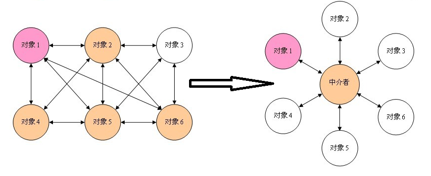

# 中介者模式(mediator)

**定义**:用一个中介对象封装一系列的对象交互,中介者使各个对象不需要显示地相互作用,从而使其耦合松散,而且可以独立地改变他们之间的交互.
**优点**:减少类之间的依赖,把一对多,变成了一对一,降低了耦合性.

### 角色:

**抽象中介者**：中介者角色的统一接口
**具体中介者角色**：通过协调各同事角色实现协作行为,为此它必须依赖于各个同事角色
**同事角色**：拥有两种行为,自发行为,与其他同事类或中介者没有任何依赖.依赖行为,必须依赖中介者才能完成的行为.


### 实现:
同事类用构造函数注入中介者,中介者通过getter/setter方法注入同事类

**中介者类**

```java
public abstract class AbstractMediator {
    /** 同事类1 */
    protected ConcreteColleague1 c1;
    
    /** 同事类2 */
    protected ConcreteColleague2 c2;
    
    public ConcreteColleague1 getC1() {
        return c1;
    }
    
    public void setC1(ConcreteColleague1 c1) {
        this.c1 = c1;
    }
    
    public ConcreteColleague2 getC2() {
        return c2;
    }
    public void setC2(ConcreteColleague2 c2) {
        this.c2 = c2;
    }
    
    /**  
     * @Description  同事类之间的交互逻辑   
     */
    public abstract void doSomething1();
    
    /**  
     * @Description  同事类之间的交互逻辑
     */
    public abstract void doSomething2();
}
```


**同事类**

```java
public abstract class AbstractColleague {
    /** 同事类必须有中介者 */
    protected AbstractMediator mediator;
    
    /**
     * @Description  通过构造函数注入中介者 
     * @param mediator  中介者对象
     */
    public AbstractColleague(AbstractMediator mediator) {
        this.mediator = mediator;
    }
}
```


**应用场景**:N个对象之间产生了相互依赖的关系(N>2),类图呈现网状结构.而且依赖的行为不确定或者有可能发生改变的可能.

