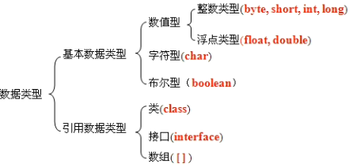

# 数据类型和运算符

## 标识符

由大小写字母，数字，_$组成的自定义名称，其中不能以数字开头，且不能和关键词重名。

**正则表达式**：`^[A-Za-z_$][A-Za-z0-9_$]*$`


## 基础数据类型



| 类型    | 范围                    | 备注    |
| ------- | ----------------------- | ------- |
| byte    | 8位(-2^7^~ 2^7^-1)      |         |
| short   | 16位(-2^15^~2^15^-1)    |         |
| int     | 32位(-2^31^~2^31^-1)    |         |
| long    | 64位(-2^63^~2^63^-1)    | 末尾加L |
| float   | 32位(1符号8指数23尾数)  | 末尾加f |
| double  | 64位(1符号11指数52尾数) |         |
| char    | 16位(0~2^16^-1)         |         |
| boolean | true/false              |         |


## 运算符

| **类别** | **操作符**                                   | **关联性** |
| -------- | -------------------------------------------- | ---------- |
| 后缀     | () [] .   (点操作符)                         | 左到右     |
| 一元     | + + -   ！〜                                 | 从右到左   |
| 乘性     | * /％                                        | 左到右     |
| 加性     | + -                                          | 左到右     |
| 移位     | >>   >>>  <<                                 | 左到右     |
| 关系     | >>=   <<=                                    | 左到右     |
| 相等     | ==    !=                                     | 左到右     |
| 按位与   | ＆                                           | 左到右     |
| 按位异或 | ^                                            | 左到右     |
| 按位或   | \|                                           | 左到右     |
| 逻辑与   | &&                                           | 左到右     |
| 逻辑或   | \| \|                                        | 左到右     |
| 条件     | ？：                                         | 从右到左   |
| 赋值     | = + = -   = * = / =％= >> = << =＆= ^ = \| = | 从右到左   |
| 逗号     | ，                                           | 左到右     |

- `< <= >= >` 只支持数值类型数据比较
- `/`两个整型相除,结果强制转换为整形，**正负跟随被除数**。 

-  3+"2"结果为"32"(任何和字符串相加为连接)
- ++在前和在后的差别:     j = i++ ,j为i     j = ++i,j为i+1  


#### 取余运算符

- **对于整数**： a%b=a-(a/b)*b 
- **操作数中有浮点数：** a%b=a-(b*q),这里q=int(a/b)      

例如：5%-2结果为1(5-(-2*（5/-2）))      


#### 逻辑运算符

&和&&的差别是当&&左边判定为假时,会跳过右边判断语句,直接输出假.同理||和|.  


#### 位运算

- 位运算的操作数是整形数，包括int、short、long、byte和char。位运算的结果只能是int、long。
- 左移位：<<，有符号的移位操作 左移操作时将运算数的二进制码整体左移指定位数，左移之后的空位用0补充  

- 右移位：>>，有符号的移位操作 右移操作是将运算数的二进制码整体右移指定位数，右移之后的空位用符号位补充，如果是正数用0补充，负数用1补充。

- 按位右移补零操作符:>>>,左操作数的值按右操作数指定的位数右移，移动得到的空位以零填充。

- 如果操作数是char、byte、short，位运算其值自动晋升为int。 


**例题**：对两个整数变量的值进行互换 (不需要第三方变量)

​        a = a ^ b; //a = 3 ^ 5;

​        b = a ^ b; //b = (3^5)^5; b = 3;

​        a = a ^ b; //a = (3^5)^3; a = 5;

​     （a&1）  = 0 偶数  

​     （a&1） =  1 奇数 


#### 三元运算符

(条件表达式)?表达式1:表达式2   ()不是必须的       当条件表达式为true时,执行表达式1,反之,执行表达式2.


### 数据类型自动转换及溢出问题

**规则1：低字节向高字节自动转换**

byte->short->int->long->float->double     不涉及运算，例如赋值时使用。

char不可与byte，short自动转换，只能往int转，原因是char范围为正，没负，转换和被转换都会溢出

**规则2：运算时，统一向涉及运算的最高字节的类型转换。byte,short,char一律转换成int。**

(即同类型相加也会强制转换成int，导致赋值时报错。如：

byte a = 1;     byte b = 2;     a = a + b;报错      a+=b不报)

short s = 3;     s+=4;     s = s + 4; 差别是+=是赋值运算会自动判断并强制转换类型,赋值运算会直接判断后面输入数字是否溢出来报错

s = s + 4为short和int相加，结果自动转成int，int不能赋给byte所以报错。通过**强制类型转换**解决：s = (short)(s+4);

**规则3：常量不溢出可以自动转换，溢出则不行。涉及变量，有溢出可能性就不行。**


## 注释

注释不会被编译到class文件内

```Java
// 单行注释
/* 
多行注释
*/
/**
 *文档注释,可以使用javadoc命令导出API帮助文档
 */
```

| **标签**      | **描述**                                                 | **示例**                                                     |
| ------------- | -------------------------------------------------------- | ------------------------------------------------------------ |
| @author       | 标识一个类的作者                                         | @author name                                                 |
| @deprecated   | 指名一个过期的类或成员                                   | @deprecated   description                                    |
| @param        | 说明一个方法的参数                                       | @param   parameter-name explanation                          |
| @return       | 说明返回值类型                                           | @return   explanation                                        |
| @see          | 指定一个到另一个主题的链接                               | @see   anchor                                                |
| @serial       | 说明一个序列化属性                                       | @serial   description                                        |
| @serialData   | 说明通过writeObject(   ) 和 writeExternal( )方法写的数据 | @serialData   description                                    |
| @serialField  | 说明一个ObjectStreamField组件                            | @serialField   name type description                         |
| @since        | 标记当引入一个特定的变化时                               | @since   release                                             |
| @exception    | 标志一个类抛出的异常                                     | @exception   exception-name explanation                      |
| @throws       | 和   @exception标签一样.                                 | The   @throws tag has the same meaning as the @exception tag. |
| @version      | 指定类的版本                                             | @version   1.2                                               |
| {@docRoot}    | 指明当前文档根目录的路径                                 | Directory   Path                                             |
| {@inheritDoc} | 从直接父类继承的注释                                     | Inherits   a comment from the immediate surperclass.         |
| {@link}       | 插入一个到另一个主题的链接                               | {@link   name text}                                          |
| {@linkplain}  | 插入一个到另一个主题的链接，但是该链接显示纯文本字体     | Inserts   an in-line link to another topic.                  |
| {@value}      | 显示常量的值，该常量必须是static属性。                   | Displays   the value of a constant, which must be a static field. |