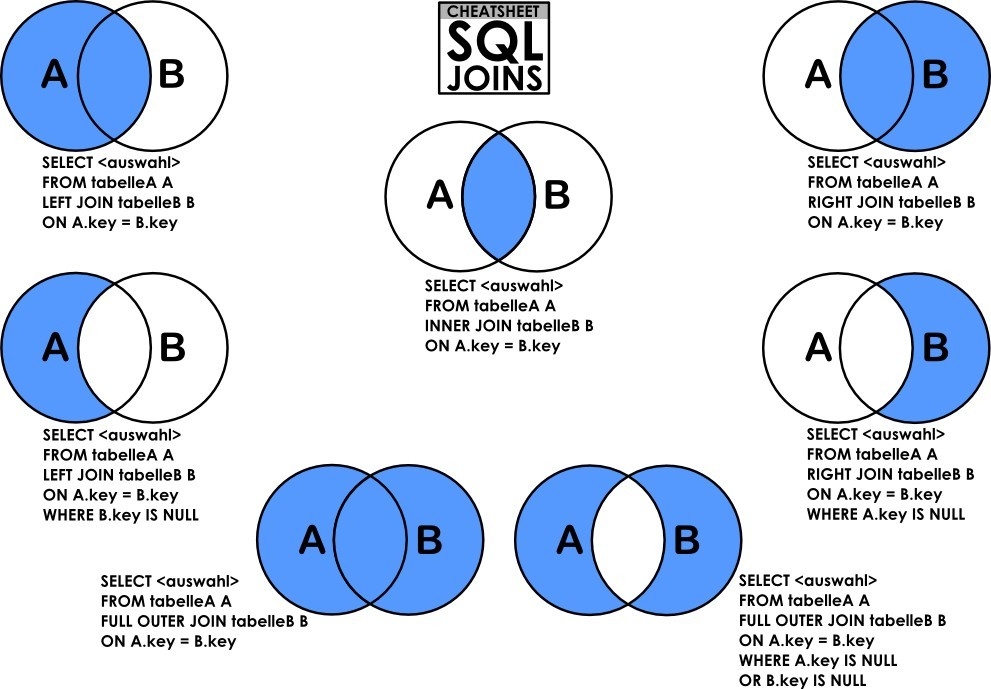

# 结构化查询语言(SQL)

不区分大小写，[]可选，非数值用''包围，字段名可以用\`\`来包围，以区别于关键字

## DDL（数据定义语言)

### CREATE(创建表)

```sql
1,CREATE database name --创建数据库
2,CREATE table name(   --创建表(每行末尾可以用回车)
     col_name1 col_type(len) [not null],
     col_name2 col_type(len) [not null],
       ...);
3,CREATE table t_name1 AS SELECT col_name(s) From t_name  --把查询结果当成表创建
```

### DROP(删除表)

```sql
1,DROP database name --删除数据库
2,drop table [if exists] table_name1,table_name2 [CASCADE|RESTRICT] --删除无关数据表
3,alter table f_table_name drop FOREIGN KEY con_name[CASCADE|RESTRICT] --解除外部约束
```

- restrict: 确保只有不存在相关视图和完整性约束的表才能删除
- cascade: 任何相关视图和完整性约束一并被删除

### ALTER（修改表）

```sql
1,alter table old_name rename to new_name --修改表名
2,alter table table_name 
	• change old_name new_name new_type  --修改字段名
	• modify col_name new_type 约束  --修改字段类型
	• add new_col_name new_type --增加字段
	• drop col_name --删除字段
	• alter col_name set DEFAULT value  --添加默认值
3,alter table table_name --修改表级约束
      add CONSTRAINT con_name  --增加表级约束 
	• PRIMARY KEY(col)_name)  --增加主键约束
	• FOREIGN KEY(f_col)references m_table(M_col)  --增加外键约束
	• CHECK(exp) --定义约束
	• DROP 约束关键字 约束名  --删除约束
```

## DML（数据操作语言）

### INSERT(新增数据)

```sql
1,INSERT INTO table_name values(V1,V2,...Vn)  --插入一行记录,列值同数同序(不建议使用,无法修改变结构因为会导致该语句失效)
2, INSERT INTO table_name (col1,col2...coln) values(V1,V2,....Vn) --插入指定列的值,多行插入就在values后写多个()用,隔开
3,INSERT INTO table_name SELECT col_name(s) FROM table_name1 --插入查询结果
```

### DELETE(删除数据)

```sql
1,delete from table_name  --删除所有行数据(清空表)
     where condition_expression  --删除指定行
2,on delete cascade  --外键约束定义语句，级联删除
```

### UPDATE(更新数据)

```sql
update table_name
set{col_name=expression}[,...n] --修改列数据,可以多列
where condition_expression --条件语句,限定范围
```

例：

```sql
update users
set user_sex='女'
where user_QQ='12302'
```

## DQL（数据查询语言）

### SELECT格式和顺序

```sql
1,select database();  --显示当前使用的数据库,未进库时显示所有库
2,select [distinct] col1,col2,..coln  --写出要显示的列,distinct消除重复,*所有列
from table1,table2,...tablen
[where conditions] --显示满足conditions的数据
[group by col_name...] --根据col_name分组并分别显示结果
--多字段分组,先按第一个分组,在对这些组按第二个分组...
[聚合函数在分组之后进行计算并显示结果]
[having conditions] --显示满足聚合函数的conditions的分组
[显示select选择的列项]
[order by col_name[asc|desc]] --按照order_list的升序或降序排序,后跟数字指第几列
多列排序:order by col_name1 asc, col_name2 desc --按1升,2降,1优先级高
[LIMIT index,count  或者 count]  --指定显示从index(0开始)开始的count个数据,或从头开始的count个数据  (mysql独有)
```

### 连接查询

#### 内连接INNER JOIN(交集)

```sql
SELECT column_name(s) FROM table1 a [INNER] JOIN table2 b
ON a.column_name=b.column_name; --等值连接
ON a.column_name between b.column_name1 and b.column_name2  --非等值连接

SELECT column_name(s) FROM table a [INNER] JOIN table b
ON a.column_name1=b.column_name2; --自连接
```

#### 外连接LEFT/RIGHT OUTER JOIN

执行步骤：先求笛卡尔积得结果集-->用on语句筛选-->把left/right表中未匹配的行以外部行的形式加到结果集上，并用null补全。

```sql
SELECT column_name(s)
FROM table1
LEFT/RIGHT [OUTER] JOIN table2
ON table1.column_name=table2.column_name;
```

#### 全连接FULL OUTER JOIN(mysql内没有)

可以用UNION把left和right结合起来就是full了

#### 多表连接

前两个表的结果表和后一个表连接

注意：ON的条件再筛选完后会补上主表的剩余的数据加上填满null值得副表，要对主副两表做限制可以先用where筛选过后的表进行关联查询

#### 内外连接图解



### 子查询

#### IN(以in里的值查询目标)

```sql
SELECT column_name(s)
FROM table_name
WHERE column_name IN (value1,value2,...);
或(SELECT column_name From…)
```

#### EXISTS(子查询有返回行时执行外查询)

```sql
SELECT column_name(s)
FROM table_name
WHERE column_name EXISTS(SELECT * From…)
```

#### WHERE(用子查询来使用聚合函数)

```sql
SELECT column_name(s) FROM table_name
WHERE column_name >(SELECT avg(name) From table)
```

#### FROM(把子查询作为临时表)

```sql
SELECT column_name(s)
FROM (SELECT * From…)
```

#### SELECT(只适用于单行子查询)

```sql
SELECT column_name(s),(SELECT column_name From…)
FROM table_name
```

### 联合查询UNION

UNION 操作符用于合并两个或多个 SELECT 语句的结果集。

**注意**：UNION 内部的每个 SELECT 语句必须拥有相同数量的列。列也必须拥有相似的数据类型。同时，每个 SELECT 语句中的列的顺序必须相同。

```sql
SELECT column_name(s) FROM table1
UNION [ALL]
SELECT column_name(s) FROM table2**;
```

All为允许重复，默认不允许，可以用''替代没有值的列

## Like通配符

| **通配符**                         | **描述**                   |
| ---------------------------------- | -------------------------- |
| %                                  | 替代 0   个或多个字符      |
| _                                  | 替代一个字符               |
| `[charlist]`                       | 字符列中的任何单一字符     |
| `[^charlist]`   或   `[!charlist]` | 不在字符列中的任何单一字符 |

1. `'A_Z'`：所有以 'A' 起头，另一个任何值的字原，且以'Z' 为结尾的字串。 'ABZ' 和 'A2Z' 都符合这一个模式，而 'AKKZ' 并不符合 (因为在 A 和 Z 之间有两个字原，而不是一个字原)。
2. `'ABC%'`：所有以 'ABC'      起头的字串。举例来说，'ABCD' 和 'ABCABC' 都符合这个套式。
3. `'%XYZ'`：所有以 'XYZ'      结尾的字串。举例来说，'WXYZ' 和 'ZZXYZ' 都符合这个套式。
4. `'%AN%'`：所有含有 'AN' 这个套式的字串。举例来说，'LOS ANGELES' 和 'SAN FRANCISCO' 都符合这个套式。